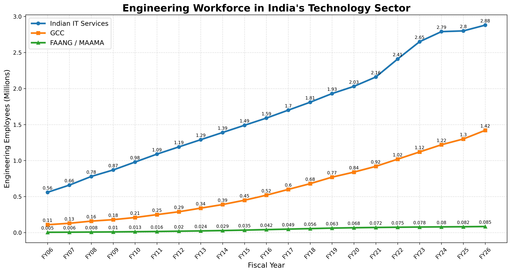

# 🇮🇳 FAANG vs GCC vs IT Services in India Headcount 📊

<p align="left">
  <a href="https://github.com/ishandutta2007/Awesome-Awesome-Awesome"></a><a href="https://discord.gg/jc4xtF58Ve"></a> <a href="https://github.com/ishandutta2007"></a>
</p>

> **Discover the definitive analysis of the Indian technology workforce. This repository tracks, compares, and visualizes headcount trends across FAANG/MAAMA companies, Global Capability Centers (GCCs), and traditional IT Services in India, providing valuable insights for industry professionals and analysts.**

This project visualizes the growth of the engineering workforce in India's technology sector over the past two decades, comparing three major segments:
*   🏢 **Indian IT Services**
*   🌍 **Global Capability Centers (GCCs)**
*   🚀 **FAANG / MAAMA Companies**

## 📖 Overview

The python script `tech_headcounts.py` contains historical headcount data from FY06 to FY26 (projected) for these three segments and generates a line chart to compare their growth trajectories. 📈

The visualization highlights the rapid expansion of GCCs and the steady scaling of Indian IT services, as well as the specialized presence of top-tier global tech firms (FAANG/MAAMA) in India. ✨



## 🛠️ Requirements

*   🐍 Python 3.x
*   📊 Matplotlib

## 🚀 Usage

1.  Ensure you have the required dependencies installed:
    ```bash
    pip install matplotlib
    ```
2.  Run the script:
    ```bash
    python tech_headcounts.py
    ```
3.  The script will display the plot and save a high-resolution image to `assets/india_tech_engineering_workforce.png`. 🖼️

##  Star History
<div align="center">
<a href="https://www.star-history.com/?repos=ishandutta2007%2FFAANG_vs_GCC_ITServices_in_India_Headcount&type=date&legend=bottom-right">
<picture>
<source media="(prefers-color-scheme: dark)" srcset="https://api.star-history.com/chart?repos=ishandutta2007/FAANG_vs_GCC_ITServices_in_India_Headcount&type=date&theme=dark&legend=bottom-right" />
<source media="(prefers-color-scheme: light)" srcset="https://api.star-history.com/chart?repos=ishandutta2007/FAANG_vs_GCC_ITServices_in_India_Headcount&type=date&legend=bottom-right" />

</picture>
</a>
</div>
